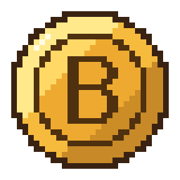

# Bitify

Instantly convert sprites and animated GIFs to 1-bit colors and styles. Runs entirely in the browser; nothing is uploaded.

**[shilo.github.io/bitify](https://shilo.github.io/bitify/)**

## Features

- Add any number of images by drag and drop, file picker or paste.
- Two colors, swap, and twelve preset palettes. Changes redraw every image at once.
- Nine styles: Cutout (filled shapes with their parts cut apart, after the game End of End), Solid, Lines (outlines each part of a sprite), Checker, Hatch, Bayer, Noise, Atkinson and Silhouette.
- Threshold slider, with a per-image Auto setting.
- Compare with the original: switch the whole wall, hold a tile, or hold Space.
- Save one PNG at original size, or all of them as a zip.
- Copy an image to the clipboard with its Copy button (on phones, from its Share button), or the first one with Ctrl+C.
- Works on desktop, iOS and Android.

## Development

```bash
npm install
npm run dev
```

`npm test` runs the unit tests, `npm run build` writes the site to `dist/`.

Built with Svelte 5 and Vite. Every push to `main` is deployed to GitHub Pages by [deploy.yml](.github/workflows/deploy.yml).

The full design is in [docs/superpowers/specs/2026-10-06-bitify-app-design.md](docs/superpowers/specs/2026-10-06-bitify-app-design.md).
