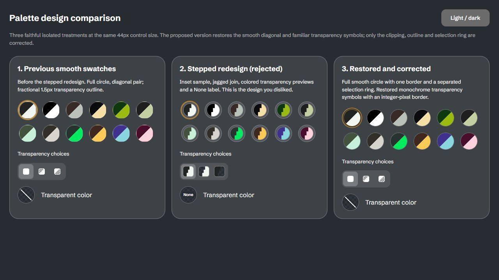

# October 9 correction pass

Implemented and independently reviewed in `codex/glasskit-prototypes`. The user's correction numbers are retained below. The prior UI snapshot remains at `a3d134e`; reviewed application changes end at `8cfb5df`.

[Try the live app](http://127.0.0.1:5188/) · [Compare the three palette treatments](palette-comparison.html) · [Screenshot gallery](gallery.html)

## Numbered decisions

| Task | Implemented behavior and challenge |
| --- | --- |
| 3 | Removed the entire empty-state note, title and subtitle. The top Import action expands to **Import, drop or paste images** on wide mouse/keyboard layouts and **Import images** on mobile/narrow layouts. Loaded layouts are icon-only. Recommended naming is **Import images**, because the click opens a picker; **Choose images** is more specific to that action. The requested longer phrase helps discovery but also mixes instructions with a button label. |
| 6 | Remove all sits immediately left of the right-side file capsule. It opens a native GlassKit-style confirmation with Cancel/Remove. Cancel, dismissal and focus restoration preserve the loaded collection. |
| 7 | Actual canvas overflow makes only the outer editing islands, panels, menus and trays opaque in the current theme. Nested buttons retain their GlassKit materials. Clearing the collection restores glass automatically. |
| 8 | Fullscreen uses the same 56px header shells, 44px circular inner controls, insets and gaps as the main header. Small filenames truncate. The fullscreen checker uses the same phase as the main canvas. |
| 10 | **Schibsted Grotesk** is global UI typography; **Lucide** is the global control icon family through the shared vendored component. The pixel brand and image conversion samples are content exceptions. |
| 11 | Shared label width measures the longest visible setting, including its changed marker. The gap is 8px; controls fill the available right column and align with Reset. A common label column is appropriate here because it aligns every control instead of introducing irregular starts. |
| 13 | Style thumbnails remain **real conversions of one representative sample sprite** using each style's current settings. All eleven default results differ. These are output previews, not unrelated decorative icons; readable style names remain beside them. |
| 14 | Restored smooth diagonal palette circles and the prior monochrome transparency symbols. Circular clipping and a separate selection ring fix uneven edges. The comparison page shows the previous smooth version, rejected stepped version and corrected smooth version at equal sizes in both themes. |
| 16 | Grid origin and median 16-source-pixel spacing anchor after collection changes or viewport resizing, then remain fixed while scrolling and opening/closing panels. Continuous alignment to a refitted image would require the checker to move; the user's requested stable background takes precedence. |
| 17 | The example uses the same image item, analysis, renderer, sizing probe and fitting system as imports, while suppressing copy/export/remove actions. It appears only with no imported images. |
| 18 | The example caption is **Bitify**; the main header contains the accessible logo alone. |
| 19 | Stationary empty-canvas presses and example activation open Import. Controls, dialogs, consumed dismissals, scrolling, swipes, secondary touches and long comparison holds are excluded. Keyboard Enter imports; Space compares. |
| 20 | Quick 150ms surface entrances and state feedback complement GlassKit. Header buttons do not translate. Geometry, checker phase and blur do not animate. Reduced-motion CSS suppresses animations/transitions. |
| 21 | Image pointer/touch and Space holds temporarily invert the persistent conversion view. Shared effective state drives the bottom toggle and all images. Independent pointer/keyboard sources prevent early restoration; release/cancel/blur/hiding clears them. This applies to image comparison, not arbitrary toolbar buttons. |
| 22 | Color edits, swaps, palettes and transparency enable conversion, including reselecting a current value. Temporary holds cannot restore an obsolete persistent preference. |

## Research and adversarial review

Two implementation agents owned separate canvas/viewer and dock/palette files. An independent agent researched and challenged the resulting implementation. Primary references were [Apple buttons](https://developer.apple.com/design/human-interface-guidelines/buttons), [alerts](https://developer.apple.com/design/human-interface-guidelines/alerts), [materials](https://developer.apple.com/design/human-interface-guidelines/materials), [reduced-motion evaluation](https://developer.apple.com/help/app-store-connect/manage-app-accessibility/reduced-motion-evaluation-criteria) and [GlassKit documentation](https://glasskit.jungherz.com/docs.html). GlassKit remains pinned to 1.22.2.

Accepted findings: independent pointer/keyboard hold ownership; cancellation when a second touch begins elsewhere; Space release after focus transfer; comparison activation guards; native-dialog focus restoration after component removal; missing display rule in the palette comparison; fullscreen checker phase; and an explicit motion-media fixture. Each fix was committed and rechecked.

Rejected or qualified findings: a checker-scroll allegation referenced an earlier in-flight file and was withdrawn after the current implementation was inspected; moving the checker with every refit conflicts with the requested stationary background; triggering comparison on every button would break normal toolbar activation; replacing all materials with solid surfaces exceeds the narrowly approved artwork/overflow protection.

The final independent review found no remaining actionable source finding. A review pass is evidence of inspection, not a claim that every browser rendering problem is eliminated.

## Validation after reviewed fixes

- **242 tests in 17 files pass.** Production build passes with 140 transformed modules and no Svelte warnings. Added checks cover stable checker anchoring and independent hold sources; existing conversion, layout, gesture, clipboard and export tests remain passing.
- Live Chromium checks at **1075×884**, **320×568** and **844×390**, both themes. No horizontal page overflow; header shells 56px and inner icons 44px. Advanced controls reach the same right edge as Reset, with an 8px label gap.
- Real picker imports through toolbar, example Enter and a stationary 400ms background press. Example and equivalent imported 28px artwork fit to the same 661px display width. Example hold does not import or open fullscreen.
- Native Space, image hold and combined Space/pointer sequences release without sticking or unintended fullscreen activation. The event driver serializes held input, so intermediate held appearance is verified by state/helper inspection rather than claimed from a screenshot.
- Confirming/cancelling Remove all, individual removal, fullscreen close/focus, comparison, Copy, color edits, palette/None selection, Rim/Reset and style selection exercised in the app.
- Repeated panel open/close and scrolling preserve checker origin and spacing. Actual overflowing wall uses opaque dark `#272c32` or light `#e8ecef` shell backgrounds; nested controls retain translucent states. Empty state restores normal glass.
- Real downloads decoded: PNG **28×28**; GIF **28×28, 8 frames**; batch ZIP **19 entries**, including GIF fixtures. Conversion/export paths remain unchanged.
- Touch/reduced-transparency/motion production fixtures verify CSS cascade and compact geometry. Motion fixture computes no surface animation and zero button transition duration. Fixtures simulate media behavior; they do not establish physical device behavior.
- Final browser warning/error console is empty. Temporary test images were removed; the app is left with the Bitify example.

## Visual comparison and remaining checks

[Light comparison](mockups/palette-old-rejected-restored-light.png), [minimal desktop](mockups/corrected-empty-desktop-dark.png), [dark phone](mockups/corrected-empty-phone-dark.png), [light phone](mockups/corrected-empty-phone-light.png), [advanced controls](mockups/corrected-advanced-desktop-dark.png), [fullscreen phone](mockups/corrected-fullscreen-phone-dark.png), [scrolling dark panels](mockups/corrected-palette-scroll-dark.png), [scrolling light panels](mockups/corrected-scrolling-palette-light.png), and [Remove confirmation](mockups/corrected-remove-confirm-dark.png).

The originally reported GIF/backdrop flicker has **not** been reproduced and verified in the affected Brave/GPU environment. Stable checker state does not prove compositor flicker is fixed. Physical iOS/Safari, real multi-touch and OS accessibility preferences remain device checks. No further user decision is required for this correction pass.
