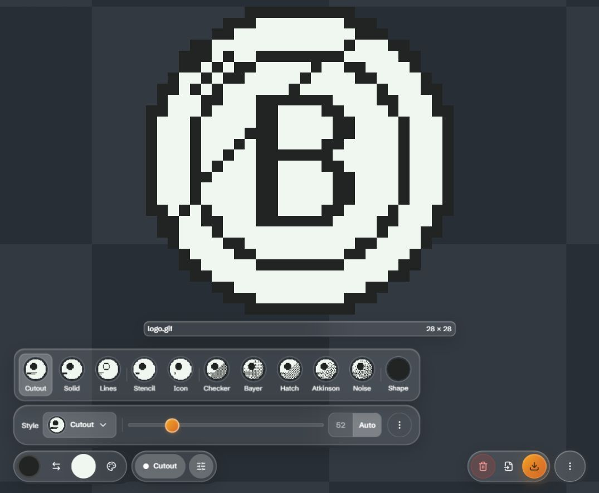

# Tasks 23–31: bottom workspace and clearer previews

Started October 9 and verified October 10, 2026 in the isolated `codex/glasskit-prototypes` worktree. Before-change checkpoint: `b3e7a98`. Application changes through `6a1b08a`; each implementation/review correction was committed separately.

[Live preview](http://127.0.0.1:5188/) · [Screenshot gallery](gallery.html)

## Numbered decisions

| Task | Result and challenge |
| --- | --- |
| 23 | Fixed palette transparency geometry: mouse segments 28×24 with 18px glyphs inside a 28px shell; coarse-pointer segments 48×48 with 32px glyphs inside a 52px shell. Padding/gaps are accounted for. Popup name/header reserves enough height, and fade offsets use actual switch dimensions. All targets fit their parent and popup. |
| 24 | Circular style frames match palette framing. Chooser previews 44px desktop/36px compact, current-style picker 32px. A simple tonal disk with an inset circle, broad seam and rim replaces the faceted sample. All eleven default previews remain distinct actual converter outputs. Names/tooltips remain essential: small Bayer/Checker/Atkinson patterns cannot identify algorithms by appearance alone. |
| 25 | Removed the top bar and brand. Editing islands sit bottom left; file/app actions bottom right. A single ResizeObserver measurement reserves the combined rows and open panels, and the canvas starts at the window top. Palette, Style, file capsule and More are independent measured items. Overflow moves upward from the bottom/right, with editing items left aligned and file/app items right aligned on every row. No fixed wrapping breakpoint remains. |
| 26 | Remove all now shares the Add/Save capsule. Semantic danger colors and confirmation distinguish destruction from file actions. |
| 27 | Fullscreen art region covers the whole viewport. The image fits with zero inset and preserved aspect, without reserving header/caption height; protected controls overlay it. Letterboxing is preferable to stretching/cropping. |
| 28 | More, Help, image-actions sheet and confirmation modal content use opaque themed surfaces, retaining GlassKit anatomy and native dialogs. Backdrops remain separate. Production computed styles confirm no content blur. |
| 29 | Touch images expose one standalone 44px Share button. No visible desktop capsule or inline Trash remains on touch; desktop retains its readable action capsule. |
| 30 | The custom image sheet orders Save(primary), Copy, Remove(error), then separated Cancel. Actions capture the selected image before closing. Removal restores focus to a remaining Share button or Add images. Save uses the same protected primary ink as the workspace. |
| 31 | User-facing language is **Add images**, **Save image**, **Save all images**, **Copy**, **Remove**. Help/tooltips/progress/failures use Save consistently. PNG/GIF/ZIP behavior is explained by context/tooltips. Internal export/encoder identifiers remain technical. |

## Research and independent challenge

Implementation agents owned style/segmented geometry and mobile Tile/sheet behavior separately. A third agent researched and reviewed the integrated changes. Sources: [Apple toolbars](https://developer.apple.com/design/human-interface-guidelines/toolbars), [buttons](https://developer.apple.com/design/human-interface-guidelines/buttons), [icons](https://developer.apple.com/design/human-interface-guidelines/icons), [action sheets](https://developer.apple.com/design/human-interface-guidelines/action-sheets/), [layout](https://developer.apple.com/design/human-interface-guidelines/layout) and [GlassKit docs](https://glasskit.jungherz.com/docs.html). Online GlassKit documentation identifies an older release than the locally pinned 1.22.2, so selectors/tokens were checked against the installed CSS.

Challenges retained: bottom toolbars are supported, but strict single-row placement is unsuitable at 320px; circular framing should not become fictional effect icons; Save refers to output files rather than a persistent project; Share here opens custom image actions rather than OS sharing destinations. Apple suggests destructive sheet actions first; the requested Save/Copy/Remove/Cancel arrangement deliberately follows task frequency in this custom sheet.

Accepted review findings: viewport-relative More/popup bounds needed horizontal safe-area protection, and failure strings still said exported. Parent challenged the suggestion to add safe-area padding to bottom controls: root padding already protects the relative app container, so a second inset would double-count it. Reviewer withdrew that part. Source review found no further actionable issue after fixes.

Browser checks found two additional real CSS bugs: compact picker sizing affected all nested chooser thumbnails, and production minification preserved blur when prefixed declarations followed unprefixed overrides. Scoped selectors and prefixed-first declaration order fixed both. Final mobile sheet and fullscreen content compute opaque surfaces with blur:none. Primary Save ink matches across sheet/workspace in light and dark modes.

## Final validation

- **242 tests across 17 files pass** after implementation and review. Build passes with 140 modules and no Svelte warnings. Viewer tests now verify aspect preservation, bounds and using the complete viewport rather than subtracting header/caption space.
- Live Chromium checks at 1075×884 desktop, 320×568 phone and 844×390 landscape. Production touch-media and reduced-motion fixtures were also checked. Fixtures simulate media/CSS rather than a physical device.
- Main grid covers the complete window. Editing/file groups have 56px shells,44px icons, no page overflow;320px uses three rows. Opening panels shrinks the fitting probe without moving the background.
- Palette segments stay wholly inside their switch and popup:36×32 mouse and 44×44 coarse. Chooser canvases compute 44×44 with50% radius on desktop and36×36 on narrow layouts.
- Fullscreen art region is 1075×884 or 320×568. Square source fits 884×884 or 320×320 without cropping, zero inset; headers remain 56px shells with44px actions. Close restores the image trigger focus.
- Mobile Share is 44×44 and a direct figure child; desktop action capsule display:none in touch fixture. Sheet ordering, Cancel/native focus, Copy success, selected-item Remove, last-item Add focus and modal Cancel/Remove were exercised.
- Imported 18 files including GIF; removed the first via sheet and saved remaining 17 as a ZIP. Parsed outputs: ZIP 17 entries including GIF; single GIF 28×28,8 frames; PNG 64×64. Real picker/encoding/download paths were used.
- Actual overflowing canvas makes only outer editing/file shells opaque with blur:none in both themes. Clearing imports restores normal glass and Bitify example. More/Help/Reset/Remove modal contents compute opaque themed backgrounds.
- Motion fixture computes surface animation:none and toggle transition0s. Production fixture console contains no warnings/errors. Temporary test images were removed and normal preview viewport restored.

## Screenshots and limits

[Desktop](mockups/bottom-workspace-desktop-dark.png), [palette desktop](mockups/bottom-palette-desktop-dark.png), [palette touch](mockups/bottom-palette-touch-dark.png), [dark phone](mockups/bottom-workspace-touch-dark.png), [light phone](mockups/bottom-workspace-touch-light.png), [dark sheet](mockups/bottom-share-sheet-touch-dark.png), [light sheet](mockups/bottom-share-sheet-touch-light.png), [fullscreen phone](mockups/bottom-fullscreen-touch-dark.png).

Physical iOS/Safari, actual multi-touch and the previously reported Brave/GIF backdrop flicker remain device/browser verification items. No further user decision is required for the implemented tasks.

## Follow-up correction verification (tasks 23 and 25)

Checkpoint bc57133; geometry bd5cfdc; wrapping c750f93. Independent subagent review found no actionable issues. The compact desktop switch retains 24px-high targets, while the touch switch keeps larger targets with visibly larger symbols; native pt/dp recommendations inform the CSS sizing rather than implying physical unit equivalence.

Verified the live loaded-image desktop layout at 1075px, 600px and the 720/721px breakpoint; the production coarse-pointer fixture at 320×740 and 844×390; transparency selection and restoration; parent containment and horizontal overflow. Wide desktop palette popup measures 66px high; desktop segments measure 28×24 and touch segments 48×48. All 242 tests and the production build passed. Touch checks use a media-query fixture, not physical iOS/Android hardware.

[Desktop proof](C:/Users/shilo/.codex/visualizations/2026/10/09/01a11fbc-7f61-7df0-a43f-50e5ca11310a/task23-compact-desktop.png), [wrapped workspace](C:/Users/shilo/.codex/visualizations/2026/10/09/01a11fbc-7f61-7df0-a43f-50e5ca11310a/task25-stacked-workspace.png), [touch targets](C:/Users/shilo/.codex/visualizations/2026/10/09/01a11fbc-7f61-7df0-a43f-50e5ca11310a/task23-touch-targets.png).

## Four independent groups correction (task 25, called step 24 in feedback)

The previous 720px stack grouped controls too coarsely and forced an unnecessary third row. A pure packing helper now measures all four islands, packs from the bottom/right, and gives each island its own row/alignment/offset. Semantic Dock/navigation wrappers retain their event and accessibility relationships while CSS display:contents exposes each island as an independent grid item. Editing panels intentionally anchor above the complete workspace; canvas reservation measures the resulting grid height. ResizeObserver watches each island, including changes between empty and loaded file actions.

Independent implementation/review agent wrote eight focused packing tests and reviewed the parent integration; no actionable finding remained. Full suite: 250 tests in 18 files pass; production build passes. Browser verification covered empty desktop widths 320,390,410,600,739,1075; Palette/Style/More opening and closing; production touch fixture with a loaded GIF and Remove/Add/Save visible. At410px only Palette is on row1, while Style and both right action units share row2. All four retain56px shell height, with no overlaps or horizontal overflow at supported phone widths. Touch verification uses a media-query fixture rather than physical hardware.

## Compact rows and mobile interaction follow-up

1. One row remains first priority. If Palette alone moving up still requires three rows, More moves beside Palette before allocating a third row. Verified loaded production touch widths320,360,390,410,600,844,1075:360/390 usePalette+More aboveStyle+files;410 keepsMore below;844/1075 useone row. At320 three rows remain necessary because152pxStyle+148pxfilecapsule+8pxgap exceeds296px available. More dialog follows the measured trigger row with safe-area and max-height protection.
2. Add is icon-only and its file capsule is hidden while empty. Example activation opened the picker successfully in the production touch fixture; original drop/paste/background entry paths remain.
3. Mobile More now lives inside the full-width52px image caption with a44px target. Save/Copy/Remove sheet order remains. The uniform62px mobile caption allowance replaces obsolete95px stacking. Help uses the same More glyph.
4. Both destructive confirmations useGlassKit error-surface/error-on-surface tokens. Cancel preserved imported images and settings in browser checks.
5. Comparison hold delay increases150→450ms. Deliberate200–449ms taps pass helper tests; pointerleave after release preserves pending clicks. Example Add and loaded fullscreen activation passed production touch-fixture checks. Native physicaltouch/pointer sequencing remains a hardware test limitation.

Two subagents implemented packing/caption changes and reviewed integration. One valid More safe-area finding was fixed in4e2ff80; final review found no actionable issue. Full suite256tests/18files and productionbuildpass; production browser has no errors/warnings.

## Fullscreen bottom workspace verification

Removed filename title/header and header measurement. Controls now overlay bottom left (local conversion, Copy, Save) and bottom right (More → Close full screen), with opaque theme shells and protected More interaction states. Viewer local conversion initializes opposite main conversion, resets per opening, and never changes the global preference. Native Cancel closes an open options menu before closing the viewer; outside-pointer dismissal and focus restoration are retained.

Production touch fixture verified390×844,844×390,320×568 and1075×884. Art region equalsviewport; square canvas dimensions390×390,390×390,320×320,884×884 respectively, with zero inherited inset. Both shells56px high, backgroundrgb(39,44,50), backdrop-filter:none. Title count0. Both main-state starting directions and local toggle/global preservation verified. Save/Copy tooltips explicitly describe converted output. Native physicaldevices remainunverified. Subagent found valid More-hover material override; fixed and rechecked. Full256tests and productionbuild pass.

